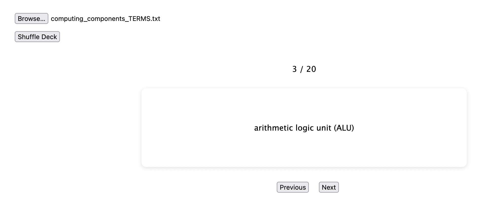

# Flash Cards

A fast and simple way to create flash cards from a text file.



## Installation

Use the terminal to clone this repository:

```bash
git clone https://github.com/technikka/FlashCards.git
```
Then open the index.html file in your browser to use this app locally.

## Usage

### Ensure a proper text file
Currently key/value pairs are recognized with a colon following the term (i.e., preemptive scheduling:)

```
const lines = content.split(/\r\n|\n|\r/);
```

and a line break after the definition

```
const terms = line.split(/:/);
```

This typically works well with copy/paste on common lists of "Key Terms" at the end of chapters, glossaries, etc. 

Just change those regex patterns in script.js to map terms differently.

### Read text file.
Browse for your text file. The only coded validation ensures it is a text file.

### Current functionality
* Click on card to switch between term and its definition.
* Buttons to move to the next card and the previous card.
* Button to shuffle the deck.
